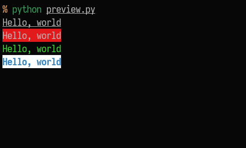

# AnsiFmt
ANSI escape sequences to format strings that are printed to terminal.

## Usage
```python
import AnsiFmt as fmt

string = "Hello, world"

# Print the string with underline
print(fmt.underline(string))

# Set it to have red background
print(fmt.bg(string, 1))

# Color can be either an integer, a hex color string or a tuple of (red, green, blue)
print(fmt.fg(string, '#3cde2f'))

# Formats can be nested since each function returns a formatted string
print(fmt.bg(fmt.fg(fmt.bold(string), 4), 15))
```


## Functions
- `bg(str, color)`
- `fg(str, color)`
- `blink(str)`
- `bold(str)`
- `dim(str)`
- `double_underline(str)`
- `hide(str)`
- `invert(str)`
- `italic(str)`
- `overline(str)`
- `strike(str)`
- `underline(str)`

`color` can either be an integer of ANSI color codes, a hex color string, or a tuple of (red, green, blue) values.
